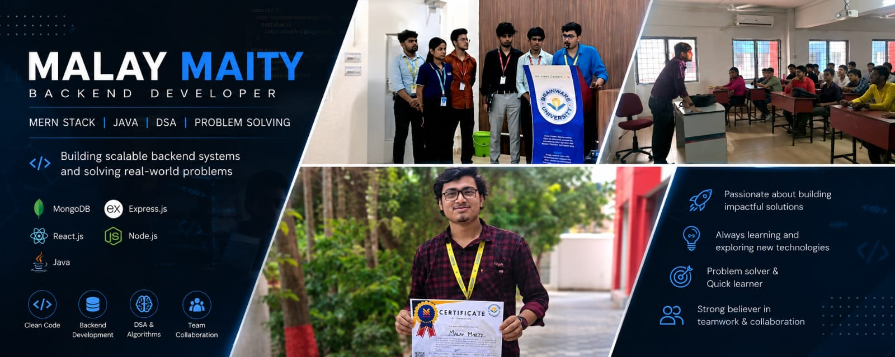

<p align="center">
  
</p>
<h3 align="center"> Full Stack Software Engineer | MERN Stack Developer | Backend Enthusiast</h3>

<p align="center">
  <a href="https://github.com/malayofficialcse-dev">
    
  </a>
  <a href="https://github.com/malayofficialcse-dev?tab=followers">
    
  </a>
</p>

---

#  About Me


Passionate Full Stack Developer focused on building scalable and high-performance web applications.

 Currently working on:
- ERP Systems
- Real-time Applications
- Scalable Backend Architectures

 Exploring:
- Advanced Backend Engineering
- System Design
- Microservices
- DevOps Fundamentals

 Strong Interest In:
- Clean Architecture
- REST APIs
- GraphQL APIs
- Authentication & Security
- Performance Optimization

Reach Me:
**malay.official.cse@gmail.com**

---

# Connect With Me

<p align="left">
<a href="https://linkedin.com/in/YOUR_LINKEDIN" target="blank">

</a>

<a href="https://github.com/malayofficialcse-dev" target="blank">

</a>

<a href="https://leetcode.com/" target="blank">

</a>

<a href="https://portfolio-link.com/" target="blank">

</a>
</p>

---

#  Tech Stack

##  Frontend Development

<p align="right">

</p>

---

## Backend Development

<p align="left">

</p>

---

## Tools & Platforms

<p align="right">

</p>

---

## Cloud | DevOps | Infrastructure

<p align="center">

<a href="https://aws.amazon.com/">

</a>

<a href="https://www.docker.com/">

</a>

<a href="https://kubernetes.io/">

</a>

<a href="https://github.com/features/actions">

</a>

<a href="https://www.jenkins.io/">

</a>

<a href="https://prometheus.io/">

</a>

<a href="https://grafana.com/">

</a>

<a href="https://kafka.apache.org/">

</a>

<a href="https://nginx.org/">

</a>

<a href="https://www.terraform.io/">

</a>

<a href="https://www.linux.org/">

</a>

<a href="https://git-scm.com/">

</a>

<a href="https://yaml.org/">

</a>

</p>

---


# Contribution & Activity

<p align="center">


</p>

---

<p align="center">


</p>

---

#  GitHub Trophies

<p align="center">

</p>


---

#  Fun Fact

```js
while(alive){
   eat();
   code();
   sleep();
   repeat();
}
```

---

<p align="center">
  
</p>
